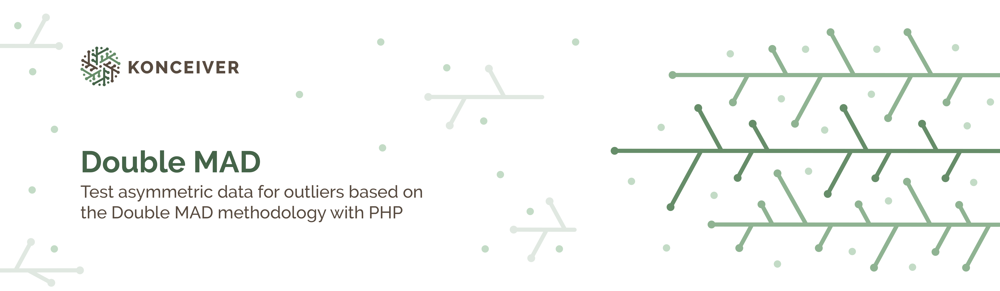

# Double MAD

<p align="center"></p>

[](https://packagist.org/packages/konceiver/double-mad)
[](https://packagist.org/packages/konceiver/double-mad)
[](https://github.com/konceiver/double-mad/actions)
[](https://codeclimate.com/github/konceiver/double-mad)
[](https://packagist.org/packages/konceiver/double-mad)

This package was created by, and is maintained by [Brian Faust](https://github.com/faustbrian), and provides an easy way to test asymmetric data for outliers based on the Double MAD methodology.

## Installation

```bash
composer require konceiver/double-mad
```

## Usage

See our [extensive test suite](./tests) for usage examples.

## Testing

``` bash
composer test
```

## Changelog

Please see [CHANGELOG](CHANGELOG.md) for more information on what has changed recently.

## Contributing

Please see [CONTRIBUTING](CONTRIBUTING.md) for details.

## Security

If you discover a security vulnerability within this package, please send an e-mail to security@konceiver.dev. All security vulnerabilities will be promptly addressed.

## Credits

This project exists thanks to all the people who [contribute](../../contributors).

## License

Double MAD is an open-sourced software licensed under the [MIT](LICENSE.md).
